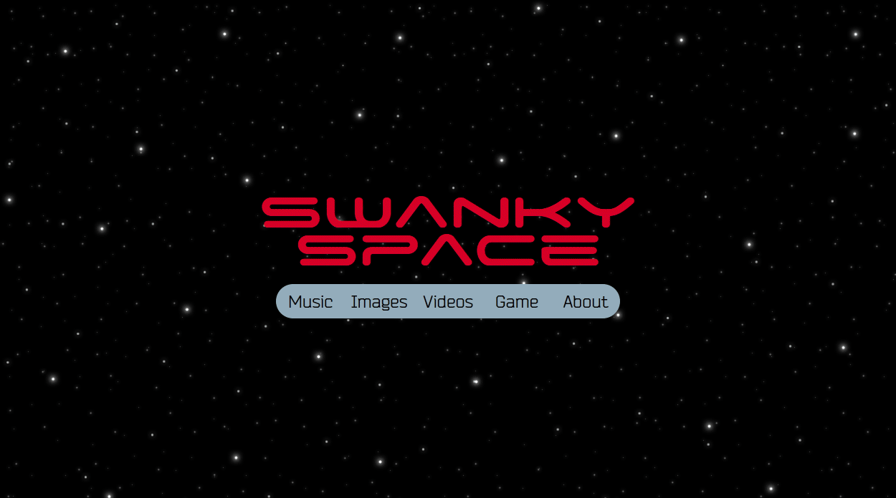
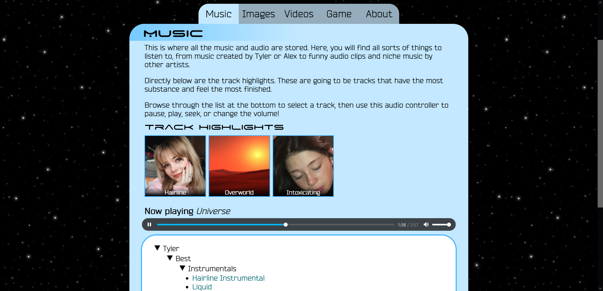
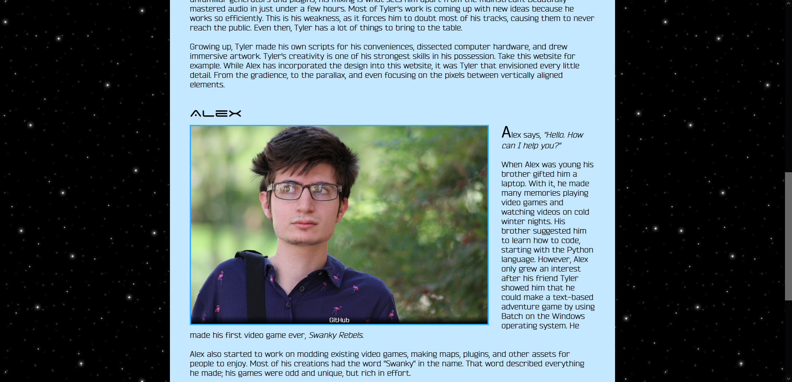

# Swanky Space Site

The Swanky Space website is me and my friend's personal website. It is supposed to be a portfolio that features all of our accomplishments. The website is supposed to be clickable, with many tabs, categories, and subcategories to explore. The whole thing is divided into 5 tabs: Music, images, videos, game, and about. This makes it easier to view the media we have to offer.

Tyler Linderman is the cofounder of the Swanky Space website. He is hosting the website using a free website hosting service and is paying monthly for the name "swanky.space". Because of this, the website is hosted with [Hypertext Transfer Protocol (HTTP)](https://en.wikipedia.org/wiki/Hypertext_Transfer_Protocol) instead of [Hypertext Transfer Protocol Secure (HTTPS)](https://en.wikipedia.org/wiki/HTTPS).

Check out the [live website](http://swanky.space/ "Visit swanky.space"). This GitHub page only shows the files and source code.

Features include:
* Website elements
* Automatic file uploading
* Background parallax on scrolling
* Image animations

## List of Files

There are a lot of files and folders being uploaded to this repository. This is the breakdown.

Server:
* Fonts/
    * List of all the fonts used in the website.
* Images/
    * The images displayed in the tree on the "Images" tab.
* Music/
    * The audio displayed in the tree on the "Music" tab.
* Pictures/
    * The image assets used throughout the website.
* Videos/
    * Videos that are displayed in the "Videos" tab.
* .htaccess
    * Disables caching on a user's web browser.
* Images List.txt
    * List of image names to automatically upload to "Images" tab.
* index.html
    * The source code for the website.
* Music List.txt
    * List of audio names to automatically upload to "Music" tab.
* script.js
    * The scripts used in the source code for the website.
* style.css
    * Styles the elements used in the source code for the website.

These files are uploaded to the server. Once changes are made, the live website will update.

Scripts:
* Images List Script.py
    * Script file to generate the "Images List.txt" file.
* Music List Script.py
    * Script file to generate the "Music List.txt" file.

These files are not uploaded to the server. They are used whenever changes are made to the `Images/` or `Music/` folders. However, text files they generate will be uploaded to the server.

GitHub:
* .gitattributes
    * Performs LF normalization.
* README.md
    * Provides information about this repository.
* scr1.gif, scr2.png, scr3.png
    * Screenshots for the "README.md" file.

These files are specific the GitHub. They do not contribute to the website.

### Music

This tab displays music made by Tyler or Alex. It also has an "other" section with random music. There is a "track hightlights" section which features music that sounds the most complete.

### Images

This tab displays images. So far, it only consists of sample images.

### Videos

This tab displays videos. So far, it only consists of a sample video.

### Game

This tab displays the game, Swanky Space. It is a video game created by Alex Akoopie. This was the original purpose of the website before it was repurposed as a portfolio.

### About

This tab explains the origins and purpose of the website.

Future updates will include:
* Background parallax on mouse movement
* Track highlights horizontal scrolling
* More content for music, images, and videos
* A tree list for the videos tab
* True automatic uploading
    * Use Python scripts on the server to detect changes to media content and regenerate lists

## Credits

Tyler Linderman - Creator, Product Designer

Alex Akoopie - Creator, Developer